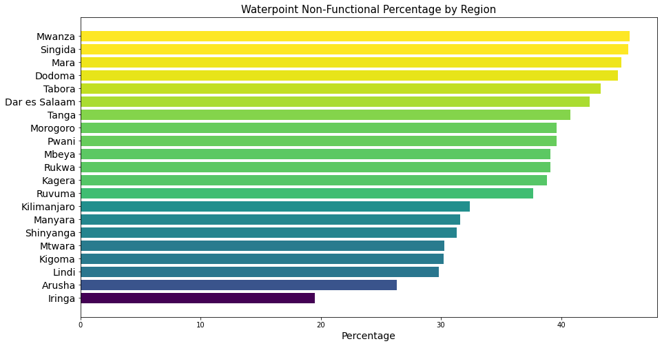
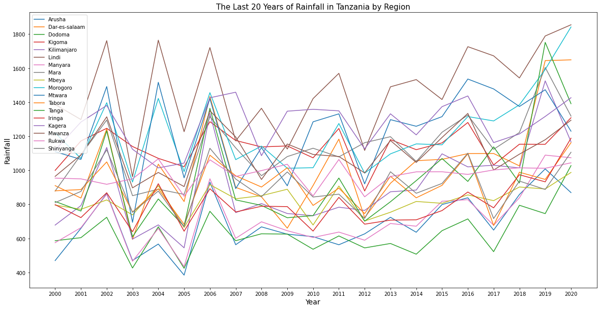
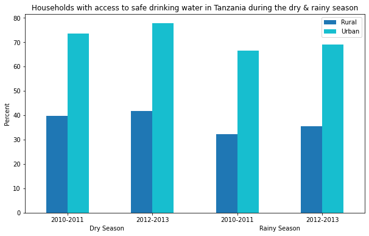

 
# Group Project: Water Improvement in Tanzania

#### Cody Can, Sb Fuller, Jackie Petersen, Kaleb Tsegaye
---

### Problem Statement

In Tanzania, clean drinking water is accessible for only 55% of the population and improved sanitation is available for only 15% of the population. The median age of the Tanzanian population is only 17.7 years of age, with a life expectancy of 62.6 years of age. Improved sanitation and access to water could vastly improve the life expectancies of Tanzanians.

For our group project we will be focusing on pumps and water points in Tanzania, their functionality, and different metrics that can inform the urgency of their repair. Using a Water Point Mapping System dataset, we created a predictive model for well functionality in Tanzania. We also obtained a collection of datasets from the World Bank Climate Knowledge Portal, The WHO UNICEF JMP Global Database, and the Tanzania Socio-Economic Database in order to produce a greater analysis on the infrastructural and climatological landscape of Tanzania by region. This analysis coupled with our predictive model served to inform next steps for prioritizing investment in some wells over others in order to save lives by bringing about the greatest improvements in utility standards across Tanzania.

**Can a model be produced that predicts water point functionality in Tanzania? Can additional information be put into an interactive application for workers in Tanzania to use for dynamic decision making?**
 
 

### Table of Contents

|#|Folder|Notebook|Description|
|---|---|---|---|
|1|code|01_Data Cleaning_EDA_1|Cleaning and EDA of Water Pump datasets, Climate & Precipitation (pr_climatology/pr_timeseries) dataset, UNICEF (washdash) dataset, & some 2012 census cleaning|
|2|code|02_Data Cleaning_EDA_2|Cleaning and EDA of 2012 Tanzania Census dataset|
|3|code|03_Geopandas EDA|Geopandas EDA with Climate & Precipitation dataset, 2020 Shapefiles, 2012 Tanzanian Census dataset, & Water Pump dataset|
|4|code|04_Modeling_Conclusion|Modeling with various kinds for predicting water pump functionality|

### The Data

|Dataset|Description|Source|Link|
|---|---|---|---|
|Pump_it_Up_Data_Training_set_labels|The dependent variable (status_group) for each of the rows in Training set values|Driven Data- Pump it Up: Data Mining the Water Table|https://www.drivendata.org/competitions/7/pump-it-up-data-mining-the-water-table/page/25/| 
|Pump_it_Up_Data_Training_set_values|The independent variables for the training set|Driven Data- Pump it Up: Data Mining the Water Table|https://www.drivendata.org/competitions/7/pump-it-up-data-mining-the-water-table/page/25/| 
|Pump_it_Up_Data_Test_set_values|The independent variables that need predictions|Driven Data- Pump it Up: Data Mining the Water Table|https://www.drivendata.org/competitions/7/pump-it-up-data-mining-the-water-table/page/25/| 
|Tanzania_2012_en|Tanzania Census Info from 2012|Tanzania National Bureau of Statistics|https://www.nbs.go.tz/index.php/en/|
|pr_climatology_annual-monthly_cru_1991-2020_TZA|Annual precipitation by region for Tanzania|World Bank Climate Knowledge Portal|https://climateknowledgeportal.worldbank.org/download-data|
|pr_timeseries_annual_cru_1901-2020_TZA|Annual precipitation by year for Tanzania|World Bank Climate Knowledge Portal|https://climateknowledgeportal.worldbank.org/download-data|
|washdash-download (1)|Water service type by region|WHO UNICEF JMP Global Database|https://washdata.org/data/household#!/table?geo0=region&geo1=sdg|
|Districts_Shapefiles_2019|Tanzania shapefiles as of 2019|Tanzania National Bureau of Statistics|https://www.nbs.go.tz/index.php/en/census-surveys/gis/568-tanzania-districts-shapefiles-2019|

### Software Requirements

1. Pandas
2. Matplotlib
3. Seaborn
4. Geopandas
5. Numpy
6. Scikit-learn
7. Folium
8. Shapely
9. Contextily
10. Imblearn

### Summary of Analysis

- The above plots show that Mwanza has the highest percentage of non-functional wells.
- Iringa has the lowest percentage of non-functional wells.
 

- The above plots show that Mwanza has the highest percentage of non-functional wells.
- Iringa has the lowest percentage of non-functional wells.
 

- This plot shows precipitation by region for the past 20 years. 
- Some regions have more erratic variation from year to year than others do. 

- This plot singles out encoded region variables with the largest and smallest precipitation ranges from year to year. 
- Regions with less range of precipitation show negative correlation with functionality.
- Regions with more range of precipitation show positive correlation with functionality.

- The best performing model had fair performance.
- 79% of all observations are correctly predicted.
- Among predicted positives, 78.6% were correctly predicted.
- Among actual positives, 79.2% were correctly predicted.
- Overall this model dramatically outperformed the baseline (50% accuracy)

### Conclusions and Recommendations
There is no “one size fits all” approach to the needs of Tanzania.

Some regions have much more water availability as precipitation than others while some regions have greater variance from year to year in precipitation than others. Different regions have different infrastuctural demands and capacityies and all of this is pretty dynamic from year to year given all of the non-profit intervention in the area. 

Information is very hard to come by in this region. Information is often incomplete or incongruous, but with the aduncance of data that we were able to dig up, we can confidently recommend that more information, better information collection practice, and greater information transparency in combination with predictive models CAN lead to the greatest improvements in living conditions in Tanzania. 

Since the nature and needs of Tanzania can be so dynamic,  predictive modeling and information transparency can be the best tools for saving lives. 

For this reason we produded an app. This app can be used by on the ground non-profit workers to pay closer attention to dynamic trends in climatological and infrastructural data as it pertains to Tanzania region by region. Accessibility and transparency of information will be key to improving the lives of Tanzanians.

### Sources

1. https://www.drivendata.org/competitions/7/pump-it-up-data-mining-the-water-table/page/25/
2. https://climateknowledgeportal.worldbank.org/download-data
3. https://washdata.org/data/household#!/table?geo0=region&geo1=sdg
4. https://worldpopulationreview.com/countries/tanzaniapopulation
5. https://www.unicef.org/tanzania/what-we-do/wash#:~:text=It%20is%20estimated%20that%20Tanzania,access%20to%20clean%20drinking%20water
6. https://en.wikipedia.org/wiki/Clinical_officer#Tanzania
7. https://www.globalhealthdelivery.org/files/ghd/files/ghd-034_ttcih_final.pdf
8. https://www.nbs.go.tz/index.php/en/census-surveys/gis/568-tanzania-districts-shapefiles-2019